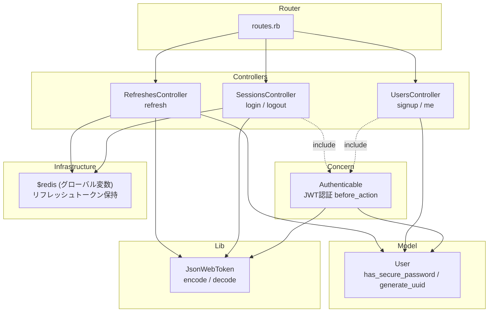

# Rails 認証API アーキテクチャレビュー

## 全体構成マップ



## 総合評価

学習用サンプルとしては **よくまとまっている**。各エンドポイントが独立したコントローラーに分かれており、責務が明確。ただし、ビジネスロジックとインフラ操作がコントローラーに混在している点は、プロダクションコードを想定した場合に改善の余地あり。

---

## ✅ 良い点

| 項目 | 詳細 |
|------|------|
| **Concern の分離** | JWT認証ロジックを `Authenticable` に切り出し、`include` で差し込む設計は Rails のベストプラクティスに沿っている |
| **`JsonWebToken` ユーティリティ** | encode/decode を `lib/` に独立した PORO として実装。コントローラーから直接 `JWT` gem を呼んでいない |
| **`has_secure_password`** | bcrypt によるパスワードハッシュ化を Rails 標準の仕組みで実現 |
| **UUID 生成** | `before_create` コールバックで自動付与。外部公開IDとして適切 |
| **ルーティング設計** | `namespace :api > :auth` で RESTful に整理されている |
| **コントローラーの粒度** | signup/me, login/logout, refresh がそれぞれ独立しており、各ファイルが30行以下で読みやすい |

---

## ⚠️ 気になる点と改善提案

### 1. コントローラーにビジネスロジックが混在

おっしゃる通り、最も大きな構造上の課題です。

**現状のコード例** — [sessions_controller.rb](file:///Users/watanabetaku/htdocs/rails-auth-api-sample/apps/api/app/controllers/api/auth/sessions_controller.rb#L7-L21)：
```ruby
# コントローラー内で以下をすべてやっている:
# 1. ユーザー検索 + パスワード認証
# 2. JWTアクセストークン生成
# 3. リフレッシュトークン生成
# 4. Redisへの保存
# 5. レスポンス組み立て
```

**問題点**:
- テスト時にコントローラーテストとして書くしかなく、ユニットテストが難しい
- login と refresh でトークン生成/Redis保存のコードが **重複** している
- Redis の操作ロジックが複数コントローラーに散在

---

### 2. `$redis` グローバル変数

[redis.rb](file:///Users/watanabetaku/htdocs/rails-auth-api-sample/apps/api/config/initializers/redis.rb) で `$redis` をグローバル変数として定義しており、コントローラーから `$redis.set(...)` / `$redis.get(...)` / `$redis.del(...)` を直接呼んでいる。

**問題点**:
- グローバル変数はテスト時のモック/スタブが困難
- Redis のキー命名規則（`refresh_token:#{token}`）がコントローラーに散在し、変更時の影響範囲が広い

**改善案**: `Rails.application.config` や定数クラスに寄せるか、後述の Service 層がラップする

---

### 3. トークン生成ロジックの重複

`sessions_controller.rb` と `refreshes_controller.rb` で以下のコードがほぼ同一:

```ruby
# 両方のコントローラーに存在:
access_token = JsonWebToken.encode(user_id: user.id)
refresh_token = SecureRandom.hex(32)
$redis.set("refresh_token:#{refresh_token}", user.id, ex: 7.days.to_i)
```

DRY原則に反しており、トークンの有効期限を変更したい場合、2箇所を修正する必要がある。

---

### 4. バリデーション不足（Userモデル）

[user.rb](file:///Users/watanabetaku/htdocs/rails-auth-api-sample/apps/api/app/models/user.rb) にバリデーションが定義されていない。

```ruby
class User < ApplicationRecord
  has_secure_password
  before_create :generate_uuid
  # validates がない
end
```

`has_secure_password` は `password` の presence を自動追加するが、`name` や `email` の validates は明示が必要:

```ruby
validates :name, presence: true
validates :email, presence: true, uniqueness: true, format: { with: URI::MailTo::EMAIL_REGEXP }
```

> [!NOTE]
> DBレベルでは `NOT NULL` / `UNIQUE` 制約があるのでデータ整合性は守られるが、モデル層のバリデーションがないと `user.errors.full_messages` が空のまま `422` を返す可能性がある。

---

### 5. エラーハンドリング

- `RefreshesController` は `Authenticable` を include していないため、認証不要エンドポイントとして正しいが、`User.find(user_id)` で `RecordNotFound` が raise された場合のハンドリングがない
- `JsonWebToken.decode` が `nil` を返す仕様だが、`Authenticable` 側で `nil` チェックに加えて `token` 自体が `nil` のケースも考慮すべき

---

### 6. レスポンス構造のハードコーディング

```ruby
render json: { uuid: user.uuid, name: user.name, email: user.email }
```

Serializer（`ActiveModel::Serializer` や `Alba`, `Blueprinter` 等）を使えば、レスポンス構造の定義を一元管理できる。ただし学習目的なら現状でも十分。

---

## 💡 Service 層を導入するなら

GEMINI.md の方針に「Rails のベストプラクティス的な構成」とあるため、完全なクリーンアーキテクチャではなく、**薄い Service 層** が落としどころです。

### 導入イメージ

```
app/
├── controllers/
│   └── api/auth/
│       ├── sessions_controller.rb   # 薄い: params受け取り → Service呼出 → render
│       ├── refreshes_controller.rb
│       └── users_controller.rb
├── services/
│   └── auth/
│       ├── token_service.rb         # JWTアクセストークン + リフレッシュトークン生成/検証/破棄
│       ├── login_service.rb         # ユーザー認証 → トークン発行
│       └── refresh_service.rb       # リフレッシュトークン検証 → トークン再発行
├── models/
│   └── user.rb                      # バリデーション追加
└── controllers/concerns/
    └── authenticable.rb             # 変更なし
```

### リファクタ後のコントローラー例

```ruby
# sessions_controller.rb
def create
  result = Auth::LoginService.call(email: params[:email], password: params[:password])
  if result.success?
    render json: result.payload, status: :ok
  else
    render json: { error: result.error }, status: :unauthorized
  end
end
```

### `TokenService` でロジックを集約

```ruby
# app/services/auth/token_service.rb
class Auth::TokenService
  REFRESH_TOKEN_EXPIRY = 7.days.to_i

  def self.issue_tokens(user)
    access_token  = JsonWebToken.encode(user_id: user.id)
    refresh_token = SecureRandom.hex(32)
    redis.set("refresh_token:#{refresh_token}", user.id, ex: REFRESH_TOKEN_EXPIRY)
    { access_token:, refresh_token: }
  end

  def self.revoke_refresh_token(token)
    redis.del("refresh_token:#{token}")
  end

  def self.redis
    Redis.current  # またはDIで注入
  end
end
```

これにより：
- トークン生成の **重複が解消**
- Redis 操作が **1ファイルに集約**
- コントローラーが **薄く** なりテストしやすい
- 有効期限等のパラメータが **定数として一元管理**

---

## まとめ

| 観点 | 現状 | 改善優先度 |
|------|------|-----------|
| コントローラーの責務 | ビジネスロジック混在 | ⭐⭐⭐ |
| `$redis` グローバル変数 | テスタビリティ低い | ⭐⭐ |
| トークン生成の重複 | DRY違反 | ⭐⭐⭐ |
| モデルバリデーション | 不足 | ⭐⭐ |
| エラーハンドリング | 部分的に不足 | ⭐ |
| Serializer | 未使用 | ⭐（学習用なら低優先） |

学習プロジェクトとしての出来は十分ですが、もしリファクタをするなら **Service 層の導入 + モデルバリデーション追加** が最もインパクトが大きい改善になります。
